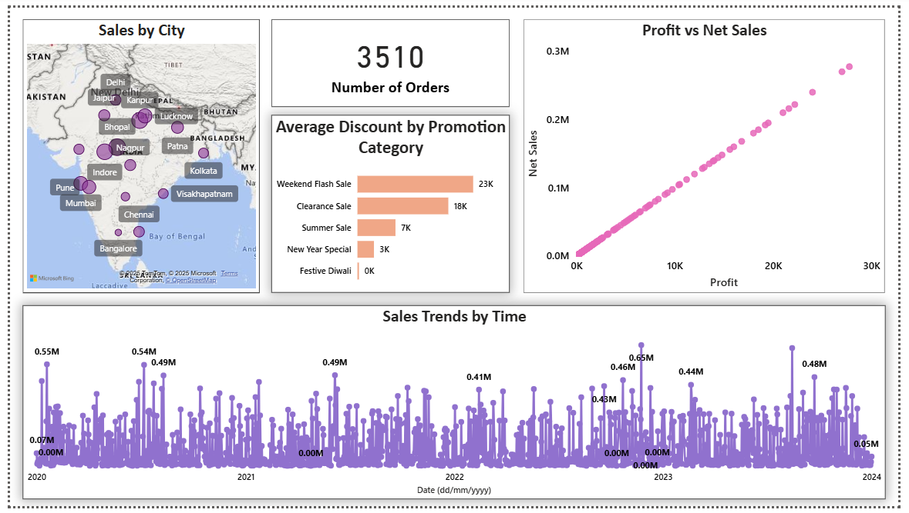

# 📊 Sales Dashboard (Power BI)

This repository contains a **Power BI report** that analyzes sales data and provides insights into performance, trends, and key business metrics.

---

## 📂 Files Included
- **`Sales-Dashboard.pbix`** → Editable Power BI report file.  
- **`Sales-Dashboard.pdf`** → Exported PDF version for quick viewing.  
- **`/screenshots/`** → Contains PNG images of the report pages for instant preview.  

---

## 🖼️ Dashboard Preview
Here’s a sample page from the report (more in the `screenshots/` folder):

---

## 🔑 Key Insights
- Overall sales and revenue performance  
- Sales by region, category, and product  
- Time-series trend analysis  
- Top-performing products and customers  

---

## 🚀 How to Use
1. Download the **`.pbix`** file.  
2. Open it with [Power BI Desktop](https://powerbi.microsoft.com/desktop/) .  
3. Explore and interact with the report pages.  

---

## 📌 Notes
- The dataset has been cleaned and modeled for reporting.  
- A static version (PDF + screenshots) is provided for quick viewing without Power BI.  

---

